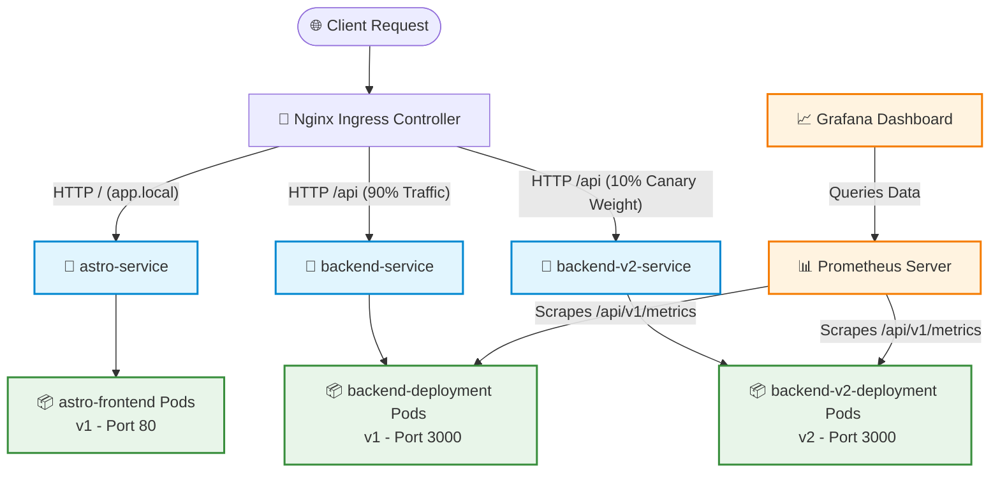

# 🚀 Zero-Downtime Kubernetes Deployments: Canary & Blue-Green Infrastructure

This repository contains the infrastructure, code, and deployment pipeline for the **NSS VIT Official Website**. The system is built with a decoupled architecture featuring an **Astro & React Frontend** and a **Node.js Express Backend API**. It leverages **Kubernetes (K8s)** and **Nginx Ingress** to support enterprise-grade deployment strategies like **Rolling Updates (Zero-Downtime)**, **Canary Deployments**, and **Blue-Green Deployments**, all monitored in real time using **Prometheus & Grafana**.

---

## 🗺️ System Architecture

The following diagram illustrates the deployment topology and network flow inside the Kubernetes cluster. It shows how traffic enters via the Nginx Ingress Controller, how Canary annotations route traffic dynamically, and how Prometheus scrapes metrics from the pods.

### Traffic Flow & Routing Architecture



### Key Components
1. **Astro Frontend**: Served via Nginx inside a lightweight Docker container, optimized for Static Site Generation (SSG) with React island components.
2. **Express Backend**: Exposes business logic endpoints, Prometheus `/metrics`, and `/healthCheck` endpoints for Kubernetes probes.
3. **Nginx Ingress Controller**: Evaluates incoming host names/paths and distributes traffic based on ingress configurations, executing canary weight splitting.
4. **Monitoring Stack**: Prometheus polls targets every 5 seconds for telemetry, feeding data into Grafana for real-time visualization of latency, error rates, and throughput.

---

## 📁 Workspace Folder Structure

The repository is organized cleanly, separating the frontend application, the backend API, and the Kubernetes manifests.

```
Zero-Downtime-Deployment-Project/
├── .github/
│   ├── workflows/
│   │   └── ci-cd.yaml                   # 🐙 GitHub Actions CI/CD pipeline definition
│   └── CICD_GUIDE.md                    # 📖 Guide for configuring pipeline secrets
├── Frontend/
│   ├── public/                          # 🖼️ Static assets
│   ├── src/                             # ⚛️ Astro & React page templates and components
│   │   └── components/                  # 🧩 Modular page layout components
│   ├── Dockerfile                       # 🐳 Multi-stage Docker build for Astro (builds static → serves via Nginx)
│   ├── tailwind.config.mjs              # 🎨 Styling tokens
│   ├── astro.config.mjs                 # 🚀 Astro static framework configuration
│   └── README.md                        # 📝 Detailed frontend documentation
├── server/
│   ├── middleware/                      # 🛡️ Request loggers, Prom metrics, & failure simulation
│   │   ├── metrics.middleware.js        # 📊 Records duration, route, and status codes for Prometheus
│   │   └── failure.middleware.js        # 🧪 Simulates API errors based on environment configuration
│   ├── routes/                          # 🛣️ Routing for health check, info, and metrics
│   ├── app.js                           # ⚙️ Express application bootstrap and middleware integration
│   ├── server.js                        # 🔌 Entry point; starts HTTP listener on Port 3000
│   └── Dockerfile                       # 🐳 Node.js production Docker image setup
├── kubernetes/
│   ├── frontend/
│   │   ├── deployment-v1.yaml           # 📦 Basic frontend deployment manifest
│   │   └── deployment-v1-enhanced.yaml  # 🚀 Production-ready configuration (Probes, Resource limits, PDB)
│   ├── backend/
│   │   ├── deployment.yml               # 📦 Version 1 backend deployment
│   │   ├── Service.yml                  # 🔌 Version 1 ClusterIP service (backend-service)
│   │   ├── backend-v2-deployment.yaml   # 📦 Version 2 backend deployment (Canary target)
│   │   ├── backend-v2-service.yaml      # 🔌 Version 2 ClusterIP service (backend-v2-service)
│   │   ├── backend-v2-enhanced.yaml     # 🚀 Enhanced Version 2 setup (HPA, PDB, ConfigMap, Probes)
│   │   └── monitor.yaml                 # 📊 Prometheus CoreOS ServiceMonitor resource
│   └── ingress/
│     ├── app-ingress.yaml               # 🔀 Main routing ingress (routes / to frontend, /api to v1 backend)
│     └── backend-canary-ingress.yaml    # 🐣 Canary routing ingress (routes 10% of /api to v2 backend)
├── docker-compose.yaml                  # 🐳 Local environment orchestrator (app, Prometheus, Grafana)
├── prometheus.yml                       # 📊 Scraper configuration for local Prometheus container
└── README.md                            # 📖 Main documentation (this file)
```

---

## 🔄 Deployment Strategies

This project is built to showcase and execute three main deployment paradigms: **Rolling Updates (Zero-Downtime)**, **Canary Deployments**, and **Blue-Green Deployments**.

### 1. Zero-Downtime Rolling Updates
In a rolling update, Kubernetes replaces old pods with new pods incrementally. By default, updates can cause downtime if pods are shut down before new ones are ready to serve traffic. To prevent this, our production manifests (`deployment-v1-enhanced.yaml` and `backend-v2-enhanced.yaml`) specify the following configuration:

```yaml
spec:
  replicas: 2
  strategy:
    type: RollingUpdate
    rollingUpdate:
      maxSurge: 1          # Spawns 1 extra pod during update before killing old pods
      maxUnavailable: 0    # Ensures 100% of the target replica count is available at all times
```

#### How it works:
1. **Liveness & Readiness Probes**:
   - **Readiness Probe** (`/api/v1/healthCheck`): Tells K8s when a pod is fully initialized. The ingress *will not* route traffic to a new pod until the readiness probe returns `HTTP 200`.
   - **Liveness Probe**: Monitors the pod's health continuously. If a pod crashes or becomes unresponsive, Kubernetes kills and restarts it.
2. **Graceful Shutdown**:
   - During rollout, the old pod receives a `SIGTERM` signal. 
   - A `preStop` lifecycle hook introduces a delay (`sleep 15`) to allow in-flight connections to complete before the pod terminates:
     ```yaml
     lifecycle:
       preStop:
         exec:
           command: ["/bin/sh", "-c", "sleep 15"]
     ```

---

### 2. Canary Deployments (Traffic Splitting)
Canary deployments roll out a new version (`v2`) to a small subset of users (e.g., 10%) to test stability before upgrading the entire cluster.

We achieve this using **Nginx Ingress Canary Annotations**:

* **Primary Ingress (`app-ingress.yaml`)**:
  Routes `http://app.local/api` to `backend-service` (pointing to `v1` pods).
* **Canary Ingress (`backend-canary-ingress.yaml`)**:
  Routes `http://app.local/api` to `backend-v2-service` (pointing to `v2` pods). It contains specific ingress annotations:
  ```yaml
  metadata:
    name: backend-canary-ingress
    annotations:
      nginx.ingress.kubernetes.io/canary: "true"
      nginx.ingress.kubernetes.io/canary-weight: "10"  # Send 10% of traffic here
  ```

#### Flow:
1. **Canary Enablement**: Setting `nginx.ingress.kubernetes.io/canary: "true"` marks this ingress as a companion to the primary ingress for the same host (`app.local`) and path (`/api`).
2. **Traffic Distribution**: `canary-weight: "10"` instructs Nginx to route roughly 10% of matching client HTTP requests to `backend-v2-service`, while the remaining 90% go to the main `backend-service`.
3. **Evaluation**: Developers monitor the Prometheus/Grafana dashboard for anomalies or elevated error rates in the `v2` pod. If v2 performs perfectly, the canary weight is increased or fully promoted.

---

### 3. Blue-Green Deployments (Instant Switch)
In a Blue-Green deployment, two identical environments coexist: **Blue** (current production version, e.g., `v1`) and **Green** (new version, e.g., `v2`). Traffic is switched instantaneously from Blue to Green.

#### Implementation in this project:
Blue-Green can be executed in two ways within this setup:
* **Option A: Service Selector Switch (Atomic)**
  The main `backend-service` directs traffic to pods with the label `app: backend` (Blue).
  Once `backend-v2-deployment` (Green) is fully ready and tested, we update `kubernetes/backend/Service.yml`:
  ```yaml
  spec:
    selector:
      app: backend-v2  # Switch selector from 'backend' to 'backend-v2'
  ```
  Applying this manifest (`kubectl apply -f kubernetes/backend/Service.yml`) forces the K8s internal router to instantly direct 100% of incoming service traffic to the green pods.

* **Option B: Ingress Routing Switch**
  Alternatively, you can keep separate services and modify the `app-ingress.yaml` backend target service from `backend-service` (v1) to `backend-v2-service` (v2). Nginx reloads its configurations immediately, transferring users instantly without dropped packets.

---

## 🛠️ Local Development & Testing

You can spin up the entire architecture (including the frontend, backend, Prometheus, and Grafana) locally using Docker Compose.

### Running the Stack
1. Navigate to the root directory.
2. Run the following command to build and launch all containers:
   ```bash
   docker-compose up --build
   ```
3. Once running, access the local dashboard endpoints:
   - **Frontend**: [http://localhost:8080](http://localhost:8080)
   - **Backend API**: [http://localhost:3001](http://localhost:3001)
   - **Prometheus UI**: [http://localhost:9090](http://localhost:9090)
   - **Grafana UI**: [http://localhost:3000](http://localhost:3000) (Login with Credentials: `admin` / `admin`)

---

## 🐙 CI/CD Pipeline (GitHub Actions)

The CI/CD pipeline located in `.github/workflows/ci-cd.yaml` automates testing, packaging, deployment, verification, and rollbacks.

```
       [Developer Push to Main]
                  │
         ┌────────┴────────┐
         ▼                 ▼
   [Lint Astro]     [Lint Backend]
         │                 │
         └────────┬────────┘
                  ▼
         ┌────────┴────────┐
         ▼                 ▼
   [Build Frontend]  [Build Backend]   <-- Multi-stage Docker Builds
         │                 │
         └────────┬────────┘
                  ▼
          [K8s Deployment]             <-- Updates image via kubectl set image
                  │
         ┌────────┴────────┐
         ▼                 ▼
   [Rollout Status] [Health Check Tests]
         │                 │
         └────────┬────────┘
                  ▼
        Is Deploy Healthy?
       /                  \
     Yes                   No
     /                      \
    ▼                        ▼
[Send Slack/Logs]      [Auto-Rollback] <-- Executed: kubectl rollout undo
```

### Automatic Rollback Protection
If the deployment succeeds but fails the subsequent automated health checks or if pods crash during startup (timed out by `kubectl rollout status` after 5 minutes), the pipeline automatically runs:
```bash
kubectl rollout undo deployment/astro-deployment -n default
kubectl rollout undo deployment/backend-v2-deployment -n default
```
This restores the cluster to its previous stable running version in under 30 seconds.

---

## 🧪 Testing Failures & Rollback Simulation

To test our zero-downtime and rollback mechanism, the backend service includes a fault injection middleware (`server/middleware/failure.middleware.js`).

### Fault Configuration
You can configure a failure rate in the backend deployment environment variables:
```yaml
env:
  - name: FAILURE_RATE
    value: "0.1"  # 10% of all requests will fail with HTTP 500
```

### Induce Failure Manually
You can toggle the backend server's health status dynamically using the built-in HTTP endpoints:
* **Make Unhealthy**: Trigger a health check failure by sending a request to `/api/v1/healthUnCheck`. The readiness and liveness probes will begin returning HTTP 500, causing Kubernetes to isolate or restart the pod.
* **Make Healthy**: Restore health checks back to normal by calling `/api/v1/healthCheck` directly or letting the application status reset.
